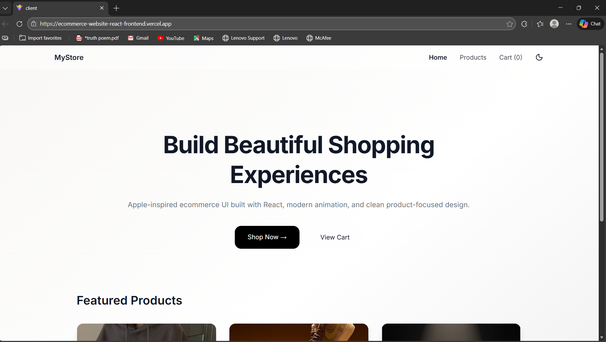

🛍️ Apple-Style Modern Ecommerce Website

A modern, animated, Apple-inspired ecommerce frontend built using React, TailwindCSS, Framer Motion, and Context API.

This project focuses on creating a premium shopping experience with clean architecture, smooth animations, and scalable component design — following product-based company engineering practices.

---

🚀 Live Demo

👉 Live Website:
(https://ecommerce-website-react-frontend.vercel.app/)

---

📸 Screenshots

🏠 Home Page

🛒 Products Page

[Products](./public/screenshots/products.png)

📦 Product Details

[Details](./public/screenshots/product-details.png)

🧺 Cart System

[Cart](./public/screenshots/cart.png)

🌙 Dark Mode UI

[Dark Mode](./public/screenshots/dark-mode.png)

---

✨ Features

🎨 UI & Experience

- Apple-inspired glassmorphism navigation
- Dark / Light mode with system preference detection
- Smooth animations using Framer Motion
- Responsive mobile-first design
- Professional UI spacing and hierarchy

🛒 Ecommerce Functionality

- Product listing page
- Product detail view
- Cart system using React Context API
- Quantity controls (+ / - buttons)
- Subtotal calculation
- Duplicate product handling
- Animated add-to-cart feedback

⚡ Engineering Practices

- Clean component architecture
- Reusable UI components
- State management using Context API
- Modular folder structure
- SPA routing with React Router
- Production-ready deployment

---

🧱 Tech Stack

Frontend

- React (Vite)
- TailwindCSS
- Framer Motion
- React Router
- React Hot Toast

State Management

- React Context API

Deployment

- Vercel

---

📁 Project Structure

src/
│
├── components/
│   ├── Navbar.jsx
│   ├── ProductCard.jsx
│
├── pages/
│   ├── Home.jsx
│   ├── Products.jsx
│   ├── ProductDetail.jsx
│   ├── Cart.jsx
│
├── context/
│   └── CartContext.jsx
│
├── layouts/
│   └── MainLayout.jsx
│
└── data/
    └── products.js

---

⚙️ Installation

Clone repository:

git clone YOUR_GITHUB_REPO_LINK

Install dependencies:

npm install

Run development server:

npm run dev

Build production version:

npm run build

---

🧠 Key Concepts Demonstrated

- Component-driven architecture
- Advanced UI animation techniques
- Context API state management
- SPA routing
- Responsive design system
- Professional folder organization

---

📦 Packages Used

react
react-dom
react-router-dom
tailwindcss
framer-motion
react-hot-toast
vite

---

🌟 Future Improvements

- Backend API integration
- Authentication system
- Payment gateway
- Wishlist feature
- Database persistence

---

👩‍💻 Author

Anushka Tiwari

GitHub: https://github.com/tiwarianushkaa 

---

⭐ Why This Project?

This project demonstrates strong frontend engineering fundamentals suitable for product-based companies including FAANG-level frontend roles:

- Clean architecture
- Reusable components
- UX-focused implementation
- Production deployment workflow

---
